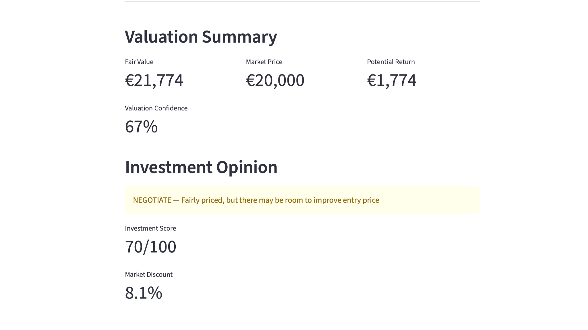
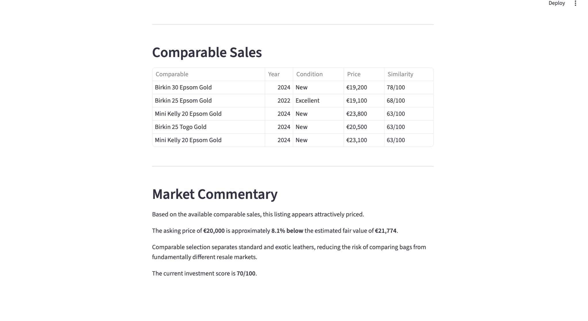

# 👜 Luxury Alpha
## Dashboard



## Analysis



A Python-based valuation engine designed to estimate the fair market value of Hermès handbags using a comparable-sales methodology inspired by financial valuation techniques.

---

## Overview

Luxury Alpha helps estimate whether a Hermès handbag is attractively priced by comparing it with similar market transactions.

The application combines comparable valuation, investment scoring and market indicators to provide a structured investment opinion.

---

## Features

- Fair Market Value estimation
- Comparable Sales Analysis
- Investment Score (0–100)
- BUY / NEGOTIATE / PASS recommendation
- Market Discount calculation
- Potential Return estimation
- Rarity & Liquidity indicators
- Guided valuation interface built with Streamlit

---

## Methodology

Luxury Alpha follows a comparable-sales approach similar to valuation methods used in finance.

Each comparable is scored according to:

- Model
- Size
- Leather
- Hardware
- Year
- Condition

The closest comparable transactions are selected to estimate a fair market value.

Additional adjustments are applied based on product characteristics such as colour rarity.

---

## Tech Stack

- Python
- Streamlit
- Pandas
- RapidFuzz

---

## Project Structure

```
Luxury Alpha
│
├── app_streamlit.py
├── bags.csv
├── knowledge.py
├── README.md
```

---

## Example Output

The application provides:

- Fair Value
- Market Price
- Potential Return
- Valuation Confidence
- Investment Score
- Comparable Sales
- Market Commentary

---

## Future Improvements

- Integration of live resale market data
- Larger comparable-sales database
- Advanced rarity and colour models
- Historical price tracking
- Machine learning valuation model

---

## Author

**Chiara Montagnon Palazzotti**

BSc in International Economics and Management  
Bocconi University
